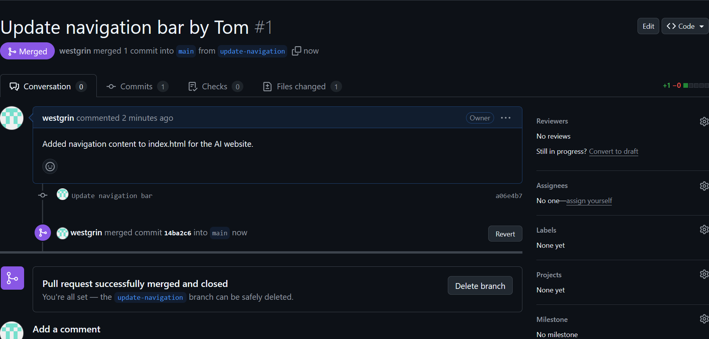
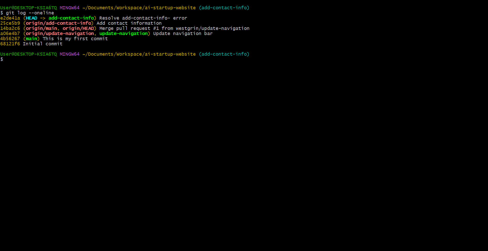
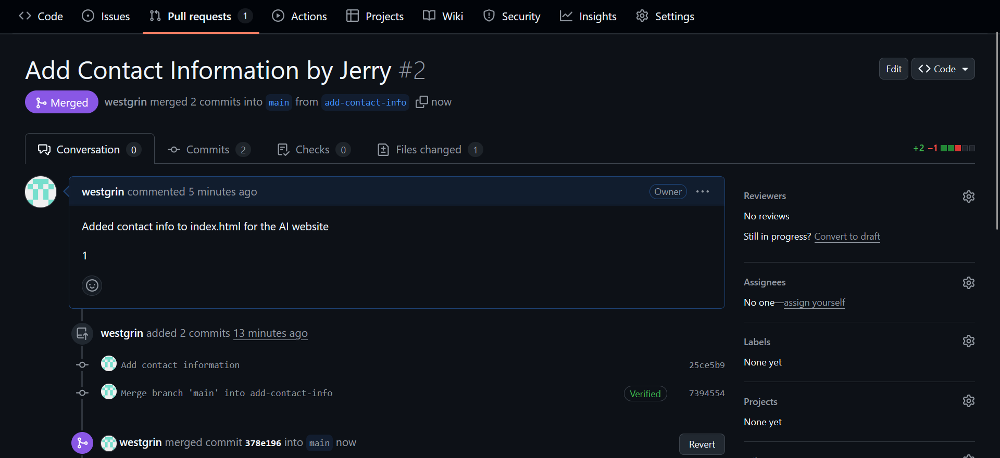

# ai-startup-website

### Part 3: Merging Changes
- **Tom’s Pull Request**:
- Created a pull request for `update-navigation` on GitHub.
- Title: “Update Navigation Bar by Tom”
- Merged into `main`.
- **Screenshot**: Tom’s merged PR:
  
- **Update Jerry’s Branch**:
- Switched to `add-contact-info` and pulled changes from `main`: `git pull origin main`.
- Pushed the updated branch: `git push origin add-contact-info`.
- **Screenshot**: Jerry’s updated branch history:
  
- **Jerry’s Pull Request**:
- Created a pull request for `add-contact-info`.
- Title: “Add Contact Information by Jerry”
- Merged into `main`.
- **Screenshot**: Jerry’s merged PR:
  

## Tools Used
- **Git Bash**: For Git operations (pulling, pushing, branching).
- **VS Code**: For editing `index.html` and updating this documentation.
- **GitHub**: For hosting the repository and managing pull requests.

## Lessons Learned
- Pull requests enable team review and safe merging.
- Updating branches before merging reduces conflicts.
- Git facilitates seamless collaboration by integrating contributions.

## Repository Link
[GitHub Repository](https://github.com/westgrin/ai-startup-website)

## Conclusion
This project completed the collaborative workflow by merging Tom and Jerry’s contributions, highlighting Git’s power in managing teamwork and ensuring project integrity.